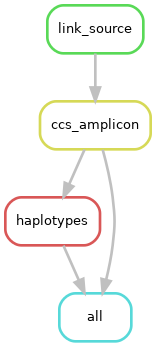

# Phasing 

**Creation of phased allele sequences**  

The phasing module generates phased and polished allele sequences:  
- CCS sequences are used to partition the sequences into potential phases
- LAA is used to generate high quality consensus sequences for each phase
- Metrics and summaries are produced to aid with interpretation

## Requirements
- [Conda/Miniconda](https://conda.io/miniconda.html)  

## Installation
- Clone the repository
  - `git clone https://github.com/lumc-pgx/phasing.git`

- Change to the phasing directory
  - `cd phasing

- Create a conda environment for running the pipeline
  - `conda env create -n phasing -f environment.yaml`

## Configuration
Pipeline configuration settings can be altered by editing [config.yaml](config.yaml).  

## Execution
- Activate the conda environment
  - `source activate phasing`
- Run the Snakefile using snakemake

